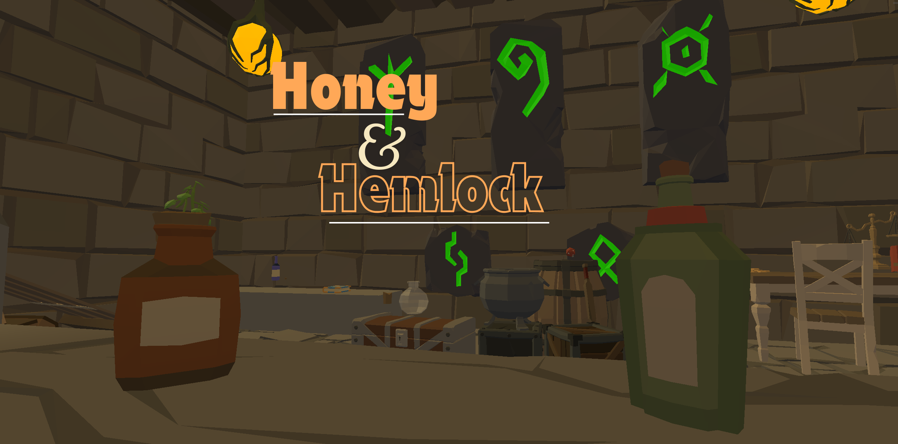

# 🍯 Honey & Hemlock

**🏆 1st Place: Enjoyment | 🏆 1st Place: Presentation | 🥈 2nd Place: Use of Theme**

*A cozy VR potion-brewing shop with a dark secret.*

## 📖 What is this project?

**Honey & Hemlock** is a VR simulation game where you play as the owner of a fantasy potion shop, called *Honey & Hemlock*, serving quirky customers with magical remedies. Mix ingredients, stir potions, and deliver brews to adventurers and townsfolk. 

Get the recipe right, and you get happy customers with their problems solved. Get it wrong, well... things can get a bit chaotic...

But beware: some recipes should never be made.

**Built in 6 days** for [VR Game Jam 8](https://itch.io/jam/vr-jam-8) (Theme: Cosmic Horror)

**Won 1st place in Enjoyment and Presentation!!!**

---

## 🎮 Play It

- **Itch.io:** [link](https://adonix.itch.io/honey-hemlock)
- **Platform:** Quest / PCVR
- **Playtime:** 10-15 minutes

---

## ✨ Features

### Core Gameplay
- **12 unique ingredients** with 3 delivery methods (drop, pour, drip)
- **13 recipes** ranging from simple tonics to advanced elixirs
- **Physics-based VR interactions** - grab, pour, stir, bottle
- **Dynamic customer system** with infinite character variety
- **24 unique dialogue stories** across all recipes

### Polish
- **Arcane Codex** - In-game flip book with recipes and ingredient reference
- **Spatial audio design** - 15+ sound effects with randomized pitch
- **Matching Character Voice** - Pitch ranges adjust to character appearance
- **Respawn system** - Ingredients regenerate automatically
- **Tactile feedback** - Cork popping, liquid pouring, stirring loops

### The Secret
A 34-second cinematic cosmic horror sequence built with Unity Timeline. Mix the forbidden recipe to experience true existential dread.

---

## 🛠️ Systems Built

### The Potion System
Three ingredient types, three interaction methods:

- **Drop Ingredients** (mushrooms, crystals, bones) - Grab and toss directly into Cauldron.
- **Pour Liquids** (honey, hemlock, moonwater) - Uncork the bottle and tilt to pour into Cauldron.
- **Drip Essenses** (starlight, tears of dawn) - Remove dripper from bottle and squeeze the trigger to release a single drop into the Cauldron.

Each method required different physics handling. Drops needed release detection, as it felt better for the user to only add while no longer holding. Pours needed tilt angle calculation using dot products. Drips needed analog trigger input mapped to an Animation Curve for squeeze intensity.

### The Brewing Mechanics
Stirring detection was a little bit tricky. I thought about getting stirring speed and making sure they're making circular movements. However, because the VR controllers can go through objects, I had to simplify my thought process.

I used the spoon's position relative to the cauldron center, calculated the angle with `Atan2`, and tracked the angular position over time. The system accumulates rotational progress and triggers the completed potion when the player has completed enough spins. Progress can be seen by the changing color of the liquid in the cauldron. If the player stops stirring, progress decays gradually. It's forgiving enough to feel good, but precise enough to require actual circular motion!

### The Recipe System
A total of 12 ingredients and 13 recipes were created, each with different ingredient combinations and quantities. The system uses a progressive filtering algorithm to determine which recipes are still possible. This happens in real time: drop a mushing, four recipes remain; pour honey, now only two recipes match, and so on.

The recipe validation occurs in two passes: the progressive filtering, as well as the final ingredient check when stirring completes. This prevents false matching and cauldron contamination during the stir, all while keeping performance optimized.

### The Customer AI
Customers are procedurally generated from modular parts (heads, bodies, clothing, and even elf ears!) giving an almost infinite number of possible combinations. They follow a state machine: 
 - Walk in -> Request potion -> Wait -> Receive Potion -> Walk out -> Spawn new Customer

 Each of the 12 recipe types have two unique dialogue variants written for them. That's 24 different stories across the game, plus success/fail responses, as well as a special "Cosmic Horror" response if they happen to also experience the special secret!

 The dialogue UI element types out letter-by-letter with randomized pitch beep sounds. I wrote a system that adjusts the pitch ranges based on the character's appearance. Larger and more muscular characters get lower voices, while smaller and slimmer characters get a high pitched voice. It's a small detail, but I believe it adds quite a lot to the user experience.

 ### The Cosmic Horror Sequence
 34 seconds of pure COSMIC HORROR! Built entirely with Unity Timeline.

 It starts with a bang and a white flash with ears ringing. As the white flash fades, the player is found floating in space. For 8 seconds, nothing happens, allowing the player to explore the planets and stars and building anxiety.

 A large cosmic being appears for two seconds and vanishes instantly.

 A full sequence tied with action shots and loud sounds before sending the player back to the potion shop. The player finds out that the customer in the shop also experienced the sequence, and has a new dialogue line, which may hint at what kind of potion they require, giving the players a little advantage.

 I'm particularly proud of the pacing here. Giving the player time to adjust to the sudden change in environment build anxiety, but also a sense of curiousity.

 ---

 ## 🧩Technical Challenges
### Problem: Ingredient Respawning Without Prefab Loop
When I tried to make ingredients respawn themselves by referencing their own prefab, Unity creates a self-referencing loop, and instead of creating a new instantiation of themselves, it creates a new instance of the current state of the current object. For example, when respawning the Honey bottle, instead of grabbing the HoneyBottle prefab, it takes a snapshot of the current Honey bottle in the Hierarchy, and creates a new instance of that snapshot, instead of the prefab.

**Solution**: I created a ScriptableObject intermediary `RespawnSO` that simply holds a reference to the prefab, and each respawnable object references its own RespawnSO. This breaks the automatic self-referencing loop that Unity creates while keeping the respawn logic clean and independent.

### Problem: Recipe Matching Performance
The initial approach for recipe matching was to check each recipe against every ingredient combination, which scaled poorly as ingredient counts grew. Even though performance remained acceptable, the algorithm was not optimal, especially for VR's tight frame budgets.

**Solution**: I applied a progressive filtering algorithm that prunes any non-matching recipe once an ingredient is added. Since the list decreases for each ingredient added, the algorithm speeds up the more ingredients are added. This reduces the search space incrementally, so the final stirring step evaluates the remaining recipes left, if they exist. Backwards iteration was also implemented to ensure safe in-place removal without copying.

### Problem: Shader Quality in Builds
The game looked perfect in Unity Editor, and played remarkably well. However, in builds, all liquid shaders were a plain white with no patterns, and all colors were flat, making it difficult to percieve distances in VR. Unfortunately, I was only able to fix this problem after the deadline of the Game Jam.

**Solution**: Unity was defaulting the quality to its lowest setting, destroying the shaders and reducing the colors, shadows, and lights. Forcing Unity to use the Ultra settings, and rewriting the shader compatibility for URP's mobile rendering path allowed it to match original Editor quality without inducing performance issues. Although this was a post-jam fix, I believe it is worth documenting.

---

### Tech Stack
- **Engine**: Unity 6000.3.4f1 LTS
- **VR Framework**: XR Interaction Toolkit v3.3.1
- **Architecture**: Event-drivien with ScriptableObject data design
- **Languages**: C#

---

## 📊 Development Timeline

| Day | Focus | Deliverable |
|-----|-------|-------------|
| 1 | Foundation | VR rig, grab system, drop & pour ingredients |
| 2 | Brewing Core | Drip mechanic, cauldron detection, ingredient types |
| 3 | Recipe System | Stirring mechanic, recipe matching, bottle filling |
| 4 | Customer Loop | Character spawning, animations, randomization |
| 5 | Integration | Dialogue system (24 stories), potion delivery, success/fail |
| 6 | Polish & Ship | Audio, cosmic horror, codex, environment art, build |

**Post-jam:** Fixed shader bugs, optimized build settings, polished UX

---

## 🚀 Future Plans

#### Potential features for v1.0:
- Tutorial mode for first customer
- Realistic Particle effects for pour streams
- Color-coded corks for better UX
- "Drink potion" interaction
- Object timeout respawn system
- Expanded cosmic horror lore

---

## 🤝 Contributing

This is a solo jam project, but feedback is welcome!

---

## 📜 License

MIT License - see [LICENSE](LICENSE.txt) for details.

This repository contains source code only. Most Game assets are not included.

---

*"Brew potions, serve customers, absolutely do not check the hidden drawer."*